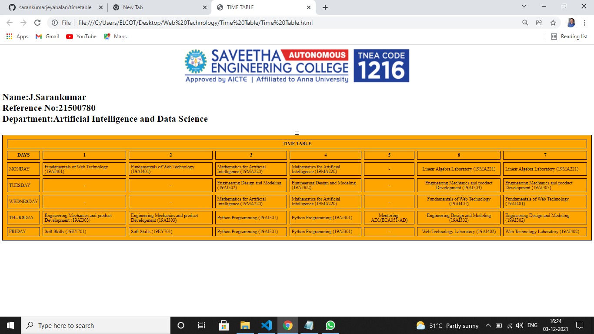

# Experiment_Time_Table

## AIM
To Write a html webpage page to display your timetable.

# ALGORITHM
### STEP 1
create a simple table using table tag
### STEP 2
Add header row using th tag
### STEP 3
Add your timetable
### STEP 4
Execute the program

# CODE
~~~
<!DOCTYPE html>
<html>
<head>

</head>
<html>

   <head>
      <title>TIME TABLE</title>
   </head>
   <body>
     

   
   

      <table border = "1" cellspacing="1" bgcolor="white" align="center">
         </tr>
    <h1>Name:J.Sarankumar 
    Reference No:21500780 
    Department:Artificial Intelligence and Data Science</h1>
      <table border = "1" cellspacing="1" bordercolor="blue" bgcolor="orange">
         <tr>
            <th colspan="10">TIME TABLE</th> 
         </tr>
         
         <tr>
            <th>DAYS</th>
            <th>1</th>
            <th>2</th>
            <th>3</th>
            <th>4</th>
            <th>5</th>
            <th>6</th>
            <th>7</th>
         </tr>
          <tr>
             <td>MONDAY</td>
             <td>Fundamentals of Web Technology (19AI401)</td>
             <td>Fundamentals of Web Technology (19AI401)</td>
             <td>Mathematics for Artificial Intelligence (19MA220)</td>
             <td>Mathematics for Artificial Intelligence (19MA220)</td>
             <td align="center">-</td>
             <td align="center">Linear Algebra Laboratory (19MA221)</td>
             <td>Linear Algebra Laboratory (19MA221)</td>
         </tr>
          <tr>
             <td>TUESDAY</td>
             <td align="center">-</td>
             <td align="center">-</td>
             <td>Engineering Design and Modeling (19AI302)</td>
             <td>Engineering Design and Modeling (19AI302)</td>
             <td align="center">-</td>
             <td align="center">Engineering Mechanics and product Development (19AI303)</td>
             <td>Engineering Mechanics and product Development (19AI303)</td>
         </tr>
         <tr>
             <td>WEDNESDAY</td>
             <td align="center">-</td>
            <td align="center">-</td>
             <td>Mathematics for Artificial Intelligence (19MA220)</td>
             <td>Mathematics for Artificial Intelligence (19MA220)</td>
             <td align="center">-</td>
             <td align="center">Fundamentals of Web Technology (19AI401)</td>
             <td>Fundamentals of Web Technology (19AI401)</td>
         </tr>
         <tr>
             <td>THURSDAY</td>
             <td>Engineering Mechanics and product Development (19AI303)</td>
             <td>Engineering Mechanics and product Development (19AI303)</td>
             <td>Python Programming (19AI301)</td>
             <td>Python Programming (19AI301)</td>
             <td align="center">Mentoring-AD1(ECA051-AD)</td>
             <td align="center">Engineering Design and Modeling (19AI302)</td>
             <td>Engineering Design and Modeling (19AI302)</td>
         </tr>
         <tr>
             <td>FRIDAY</td>
             <td>Soft Skills (19EY701)</td>
             <td>Soft Skills (19EY701)</td>
             <td>Python Programming (19AI301)</td>
             <td>Python Programming (19AI301)</td>
             <td align="center">-</td>
             <td align="center">Web Technology Laboratory (19AI402)</td>
             <td>Web Technology Laboratory (19AI402)</td>
         </tr>
  
         
      </table>
      
   </body>
</html>

~~~
# OUPUT

## Result:

Time Table Created Successfully Created
